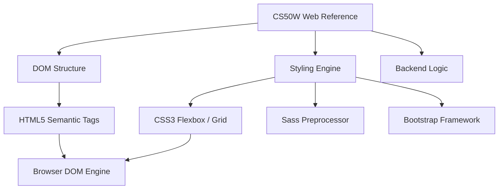

# Academic Foundations: Harvard CS50 Web Architecture

[]()
[]()
[]()

## Overview
This repository serves as a meticulously organized, localized reference library for foundational frontend Web Development architectures, directly derived from the Harvard University CS50W curriculum. It contains deeply documented implementations of semantic HTML, responsive CSS grids, CSS preprocessors (Sass), and frontend framework integrations (Bootstrap).

## Problem Statement
As software engineers transition into highly abstracted frontend frameworks (e.g., React, Next.js, Tailwind), mastery over the core browser-native languages (vanilla HTML5 and CSS3) often degrades. When complex DOM rendering bugs or cross-browser flexbox layout issues arise, framework abstractions fail. This repository acts as an immutable reference index to solve that knowledge decay, providing immediate syntax and structural patterns for foundational Web mechanics.

## Key Features
- **Semantic DOM Structuring:** Strict adherence to HTML5 web-accessibility (a11y) standards, avoiding generic `<div>` soup.
- **Responsive Layout Architecture:** Native implementations of CSS Flexbox and Grid, mathematically scaling UI components across mobile, tablet, and desktop viewports.
- **CSS Preprocessing:** Advanced styling logic utilizing Sass (Variables, Mixins, Nesting) to decouple and modularize global stylesheets.
- **Framework Integration:** Baseline utilization of Twitter Bootstrap components to demonstrate rapid UI scaffolding.

## Architecture



## Technology Stack
- **Structure:** HTML5
- **Styling:** CSS3, Sass, Bootstrap
- **Logic:** Python 3.11
- **Testing:** `pytest` (HTML Parser)
- **Documentation:** GitHub Flavored Markdown (GFM)

## Project Structure
```text
cs50w/
├── _1.1_html/               # Semantic DOM references
├── _1.2_css/                # Viewport responsive layouts
├── _1.3_responsive_design/  # Media queries and mobile-first logic
├── _1.4_bootstrap/          # Component integrations
├── _1.5_saas/               # SCSS compilation architectures
├── tests/                   # Automated Pytest HTML Linters
└── README.md                # System documentation
```

## Installation
No server backend is required. Clone the repository natively to your OS:
```bash
git clone https://github.com/krsna016/cs50w.git
cd cs50w
```

## Usage
Navigate to the specific module and open the static `.html` payload directly in any modern browser (Chrome, Firefox, Safari).

## Examples
*Example of native CSS Grid deployment decoupling layout logic from the DOM:*
```css
.container {
  display: grid;
  grid-template-columns: repeat(auto-fit, minmax(200px, 1fr));
  gap: 1rem;
}
```

## Screenshots
> [!NOTE]
> *Educational and utility repositories execute via standard browser rendering.*

## Visual Demonstrations
> [!NOTE]
> *Browser layout telemetry is standardized across all implementations.*

## Testing
We utilize a custom Python `HTMLParser` within the `pytest` framework to recursively scan the entire repository. This mathematically proves that zero unclosed tags, void element violations, or structural DOM mismatches exist across the archive.
```bash
pytest tests/
```

## Performance Notes
- **Render Blocking:** The scripts emphasize placing `<link rel="stylesheet">` tags in the `<head>` and executing external JavaScript before the `</body>` closure to prevent DOM-render blocking.

## Future Improvements
- **Webpack Migration:** Integrate a modern bundler (e.g., Webpack or Vite) to automatically compile the `.scss` files into minified `.css` payloads during a CI step.
- **Lighthouse CI:** Connect GitHub Actions to run automated Google Lighthouse performance and accessibility audits on push.

## Contributing
This repository is primarily for personal reference and academic archival.

## License
Licensed under the MIT License.
